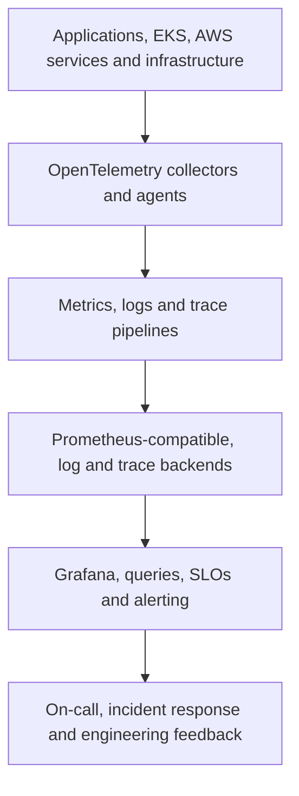

# Cloud-Native Observability Platform

A cloud-native observability and Site Reliability Engineering (SRE) blueprint for collecting, governing, and using metrics, logs, and traces at enterprise scale. It demonstrates Principal Platform Engineer decisions around OpenTelemetry, Prometheus, Grafana, service ownership, Service Level Indicators (SLIs), Service Level Objectives (SLOs), alerting, reliability, security, and telemetry cost control.

> **Status:** Reference architecture and implementation roadmap. The design is vendor-neutral at the instrumentation layer and AWS-aligned at the platform layer.

## What This Project Demonstrates

- OpenTelemetry-based instrumentation and collection with portable telemetry contracts.
- Scalable metrics, logs, and traces with consistent resource metadata.
- SLO-driven alerting that prioritizes user impact over infrastructure noise.
- Multi-team tenancy, access control, retention, and auditability.
- Reliability and FinOps controls for the observability platform itself.

## Architecture



Instrumentation is decoupled from storage. Collectors perform enrichment, filtering, sampling, redaction, routing, and backpressure control before telemetry reaches scalable backend services.

## Design Goals

- Give teams a consistent view across applications, Kubernetes, and AWS services.
- Correlate metrics, logs, and traces using shared service and deployment identity.
- Detect user-impacting failure early with actionable alerts.
- Protect sensitive data and enforce tenant-aware access.
- Control cardinality, ingestion, retention, and query cost without losing critical evidence.

## Technology Stack

| Capability | Primary technologies |
|---|---|
| Instrumentation and transport | OpenTelemetry SDKs, OpenTelemetry Protocol, Collector agents and gateways |
| Metrics | Prometheus, recording rules, Alertmanager, managed Prometheus where appropriate |
| Visualization | Grafana, service and platform dashboards |
| Logs | Fluent Bit or OpenTelemetry Collector, CloudWatch Logs, Loki or OpenSearch |
| Traces | OpenTelemetry, AWS X-Ray or Tempo-compatible storage |
| Kubernetes telemetry | kube-state-metrics, node exporters, EKS control-plane and container insights |
| Infrastructure | Terraform, Helm, GitOps, S3 lifecycle and KMS |
| Reliability | SLI definitions, SLOs, error budgets, runbooks and incident workflows |

## Repository Structure

```text
architecture/        # Telemetry, tenancy, data-flow and failure-domain views
collectors/          # Agent and gateway pipelines, processors and routing
instrumentation/     # Service conventions and language examples
metrics/             # Recording rules, alert rules and exporters
logs/                # Parsing, redaction, routing and retention patterns
traces/              # Sampling, propagation and service-map patterns
dashboards/          # Grafana dashboards and reusable panels
slos/                # SLI queries, SLOs and error-budget policies
terraform/           # AWS and observability platform foundations
gitops/              # Helm values and environment promotion
runbooks/            # Alert, ingestion, query and recovery procedures
docs/adr/            # Architecture Decision Records
```

## Security Architecture

- Mutual Transport Layer Security where supported between collectors and gateways.
- Workload identity through EKS Pod Identity or IAM Roles for Service Accounts.
- Tenant-aware authorization for dashboards, queries, alert rules, and administrative APIs.
- KMS encryption, private endpoints, restricted egress, and auditable configuration changes.
- Attribute allowlists, log redaction, secret detection, and rules preventing sensitive payload capture.
- Separate retention and access policy for security, audit, application, and platform telemetry.

## Terraform / Infrastructure Architecture

Terraform provisions AWS identities, networking, encryption, storage, managed telemetry services, and shared platform dependencies. Helm and GitOps own Kubernetes collectors, exporters, dashboards, and rules. State is separated by environment, region, backend capability, and lifecycle. Configuration modules expose throughput, retention, and resilience choices without mixing application-specific queries into core infrastructure.

## CI/CD and GitOps

Pull requests validate collector configuration, Prometheus rules, dashboard structure, SLI queries, policy, and Terraform plans. Synthetic telemetry tests prove end-to-end ingestion before promotion. Argo CD reconciles Kubernetes agents and gateways, while protected infrastructure pipelines manage AWS services. Changes roll out progressively with health and cost signals.

## Observability and SRE

The platform observes itself: accepted, dropped, retried, queued, and exported telemetry; collector memory and CPU; backend ingestion; query latency; rule evaluation; notification delivery; cardinality; retention; and tenant usage. Service dashboards connect golden signals to deployments and dependencies. Alerts include impact, owner, evidence, and a tested runbook.

## Reliability and SLOs

| Capability | Service Level Indicator (SLI) | Example Service Level Objective (SLO) |
|---|---|---|
| Metrics pipeline | Samples accepted within freshness window | 99.9% per month |
| Log pipeline | Eligible log events durably accepted | 99.5% per month |
| Trace pipeline | Selected spans accepted after sampling | 99.5% per month |
| Alert delivery | Critical notifications delivered within target time | 99.9% per month |
| Interactive queries | Queries completed below latency threshold | 99% per month |

Error-budget burn alerts use multi-window, multi-burn-rate logic to distinguish urgent failures from slow reliability erosion.

## FinOps / Cost Governance

Telemetry cost is managed through service ownership, cardinality limits, adaptive trace sampling, log filtering, tiered retention, compression, S3 lifecycle, query controls, and per-tenant usage reporting. High-value security and incident evidence is protected; low-value debug data is sampled or retained briefly. Cost per service and cost per telemetry signal are reviewed alongside operational value.

## Platform Team vs Application Team Responsibilities

| Platform team | Application team |
|---|---|
| Own collectors, backends, tenancy, availability, security and platform SLOs | Instrument services and provide consistent service, environment and ownership attributes |
| Publish dashboards, SLI patterns, alert standards and libraries | Define workload SLIs, SLOs, business signals, alerts and runbooks |
| Govern retention, cardinality, access and telemetry cost | Avoid sensitive data and control application-level telemetry volume |
| Operate shared incident and platform recovery procedures | Respond to service alerts and improve application reliability |

## Architecture Decisions and Trade-offs

| Decision | Rationale | Trade-off |
|---|---|---|
| OpenTelemetry at the instrumentation boundary | Portability and consistent telemetry contracts | Collector and semantic-convention governance is required |
| Agent plus gateway deployment | Local collection with centralized policy and routing | More components than direct-to-backend export |
| SLO-based alerting | Connects alerts to user impact and error budgets | Accurate SLI design requires service context |
| Selective sampling and retention | Controls scale and cost | Poor policies can remove evidence needed during incidents |

## Production Considerations

- Size collectors and backends for peak load, failure buffering, and regional isolation.
- Test backend outage, network partition, queue saturation, bad configuration, and cardinality explosion.
- Version semantic conventions and prevent uncontrolled changes to service identity.
- Define data residency, retention, legal hold, deletion, and privileged-query processes.
- Maintain telemetry quality scorecards covering coverage, freshness, ownership, usefulness, and cost.

## Roadmap

- [ ] Add OpenTelemetry agent and gateway configurations.
- [ ] Add EKS, AWS, application, and platform dashboards.
- [ ] Add recording rules, SLI queries, SLOs, and burn-rate alerts.
- [ ] Add log redaction, trace sampling, and cardinality policies.
- [ ] Add Terraform and GitOps deployment examples.
- [ ] Add load, failure, recovery, and telemetry-cost test scenarios.

## Author

**Suyog Dabhole** — Principal Cloud & Platform Architect focused on AWS, Kubernetes, OpenTelemetry, Prometheus, Grafana, Observability, SRE, DevSecOps, and FinOps.

[GitHub](https://github.com/Neptunesun)
